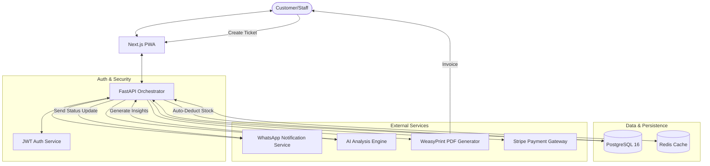

<div align="center">


# 🎫 RepairDeskz

**The ultimate digital operating system for modern independent repair shops.**  
*Built for speed. Engineered for profit. Cinematic by design.*

[](https://repairdeskz.vercel.app)
[](https://nextjs.org)
[](https://fastapi.tiangolo.com)
[](https://www.postgresql.org/)
[](LICENSE)

</div>

---

## 📖 Overview

**RepairDeskz** is a high-performance, mobile-first Progressive Web App (PWA) designed to replace paper trails and messy spreadsheets. It empowers shop owners to manage the entire lifecycle of a repair—from drop-off and digital signature to automated WhatsApp notifications and profit tracking.

The application features a **cinematic 3D landing page** that showcases the "disassembly" of a high-fidelity iPhone 17 Pro Max, visually representing the precision and technical depth of the RepairDeskz platform.

---

## ✨ Premium Features

### 🏎️ Cinematic Landing Experience
- **3D Scroll-Driven Animation**: Powered by **React Three Fiber (R3F)** and **GSAP**, featuring a high-fidelity iPhone 17 Pro Max disassembly that moves in sync with user scrolling.
- **Glassmorphism UI**: High-contrast "Digital OS" aesthetic with emerald/slate accents and premium blur effects.
- **Smooth Interaction**: Integrated with **Lenis** for silky-smooth inertial scrolling across all devices.

### 📊 Repair Operations
- **Lightning Tickets**: Create and track repair tickets in under 60 seconds with 1-click status updates.
- **Barcode & QR Sync**: Scan device assets for instant identification and inventory linking.
- **Digital Signatures**: Legal protection with on-screen signature capture for every ticket.
- **Pro Invoicing**: Generate sleek PDF invoices on-the-fly and share them instantly with customers.

### 📦 Smart Management
- **Intelligent Inventory**: Real-time tracking with low-stock alerts and automatic part deduction.
- **Profit Engine**: Automatic calculation of revenue, part costs, and net margin per ticket.
- **AI Insights**: Ask the AI assistant natural language questions about your shop's performance ("What's our most repaired phone model this month?").

### 🟢 Customer Experience
- **WhatsApp Sync**: Automated notifications for confirmation, updates, and feedback links via WhatsApp.
- **Feedback Loop**: Built-in customer feedback system to measure satisfaction and growth.
- **PWA Ready**: Fully installable on iOS and Android with offline-first synchronization.

---

## 🏗️ Project Architecture

### Monorepo Structure
RepairDeskz is organized as a unified monorepo for seamless full-stack development.

```text
RepairDeskz/
├── apps/
│   ├── api/          # FastAPI Backend (Python 3.12+)
│   │   ├── core/     # Auth, Config, Database models
│   │   ├── routers/  # RESTful API endpoints
│   │   └── services/ # AI, WhatsApp, PDF generation
│   └── web/          # Next.js Frontend (React 19+)
│       ├── components/ # Landing (3D), Dashboard, UI Kit
│       ├── store/      # Zustand state management
│       └── app/        # Next.js App Router (Pages & Layouts)
├── infra/            # Docker, Nginx & Deployment configurations
└── Makefile          # Unified dev command interface
```

---

## 🔄 Data Flow Diagram

The following diagram illustrates the lifecycle of a repair request and the interaction between the system's core components:



---

### Technical Stack
- **Frontend**: Next.js 16 (App Router), React 19, Three.js, R3F, GSAP, TailwindCSS 4.
- **Backend**: FastAPI, SQLAlchemy (Async), PostgreSQL 16.
- **3D Engine**: WebGL-based rendering with post-processing (Bloom, Noise, Vignette).
- **Communication**: WhatsApp Business API integration.
- **Deployment**: Vercel (Frontend/Serverless) + Dockerized Backend.

---

## 🚀 Getting Started

### 🛠️ One-Click Setup (Windows)
```powershell
./init-and-run.bat
```

### 🐳 Manual Setup (Docker)
```bash
# 1. Clone & Enter
git clone https://github.com/mohd98zaid/RepairDesk.git
cd RepairDesk

# 2. Setup Environment
cp .env.example .env

# 3. Boot Services
make dev

# 4. Initialize Database
make migrate
make seed
```

---

## 🗺️ Roadmap

- [x] **2024 Base**: Core CRM & Ticket Lifecycle.
- [x] **2024 Advanced**: Inventory, Parts Tracking, & WhatsApp Sync.
- [x] **2025 Cinematic Update**: High-fidelity 3D Landing Page & iPhone 17 Pro Max Model.
- [x] **2025 AI Update**: Natural Language Intelligence for Shop Analytics.
- [ ] **Next**: Multi-shop support & Global Inventory Network.

---

## 🛡️ Security & Compliance
- **JWT Authentication**: Secure stateless auth with token rotation.
- **RBAC**: Role-Based Access Control (Owner, Manager, Staff).
- **Data Integrity**: Full audit logs for status changes and inventory deductions.

---

<div align="center">
Built with ❤️ by [Zaid](https://github.com/mohd98zaid)  
*Empowering independent shops with enterprise-grade tech.*
</div>
