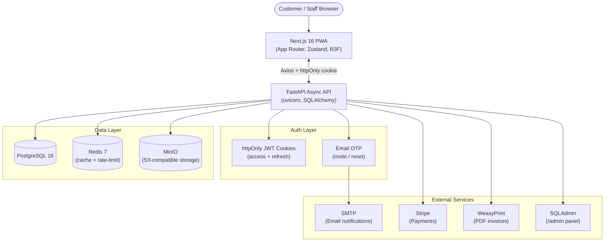

<div align="center">


# 🎫 RepairDesk

**The digital operating system for modern independent repair shops.**  
*Manage tickets, inventory, customers, and invoices — all in one place.*

[](https://render.com)
[](https://nextjs.org)
[](https://fastapi.tiangolo.com)
[](https://python.org)
[](https://www.postgresql.org/)
[](https://www.typescriptlang.org/)
[](LICENSE)

</div>

---

## 📖 Overview

**RepairDesk** is a full-stack, production-ready SaaS application that replaces paper trails and spreadsheets for independent repair shop owners. It covers the full lifecycle of a repair — from customer drop-off and digital signature capture through automated email notifications, PDF invoicing, and profit analytics — all in a single cohesive platform.

The system is a **monorepo** with a FastAPI async backend, a Next.js 16 App Router frontend (PWA-ready), and a fully Dockerized infrastructure stack including PostgreSQL, Redis, and MinIO object storage.

---

## ✨ Features

### 🎟️ Repair Ticket Management
- Create, track, and update repair tickets in under 60 seconds
- One-click status transitions (e.g., *Received → In Progress → Ready → Collected*)
- Digital signature capture on ticket creation for legal protection
- Barcode / QR scanning for instant device identification

### 👥 Customer & Team Management
- Full customer CRM with repair history and feedback tracking
- Role-Based Access Control: **Owner**, **Manager**, **Staff**
- Team member invitations via email OTP

### 📦 Smart Inventory
- Real-time parts inventory with low-stock alerts
- Automatic part deduction when a ticket is closed
- Parts linked directly to repair tickets for cost tracking

### 🧾 Invoicing & Payments
- PDF invoice generation (WeasyPrint + Jinja2 templates)
- Stripe payment gateway integration
- Revenue, parts cost, and net margin tracking per ticket

### 🔒 Auth & Security
- httpOnly JWT cookies (access + refresh tokens) with silent refresh
- OTP via email for password reset and team invitations
- Rate limiting via SlowAPI on sensitive endpoints
- CORS and CSP protection

### 📊 Reports & Analytics
- Shop-level profit reports with date range filtering
- Activity logs for all status changes and inventory events
- Full-text search across tickets, customers, and inventory

### 🌐 Progressive Web App
- Installable on iOS and Android (via Serwist / Workbox)
- Offline-capable using IndexedDB (Dexie.js)
- Cinematic 3D landing page powered by React Three Fiber + GSAP

---

## 🏗️ Tech Stack

| Layer | Technology | Version |
|---|---|---|
| **Frontend Framework** | Next.js (App Router) | ^16.2.1 |
| **UI Language** | TypeScript | ^5 |
| **Styling** | Tailwind CSS + shadcn/ui | ^4 |
| **3D / Animation** | React Three Fiber, Three.js, GSAP, Lenis | Latest |
| **State Management** | Zustand | ^5.0.12 |
| **Forms** | React Hook Form + Zod + Yup | Latest |
| **HTTP Client** | Axios | ^1.14.0 |
| **Offline Storage** | Dexie (IndexedDB) | ^4.3.0 |
| **PWA** | Serwist (Workbox) | ^9.5.7 |
| **Payments (FE)** | Stripe React SDK | ^5.6.0 |
| **Backend Framework** | FastAPI | 0.115.0 |
| **Runtime** | Python | ≥ 3.12 |
| **ORM** | SQLAlchemy (async) | 2.0.36 |
| **DB Driver** | asyncpg | 0.29.0 |
| **Migrations** | Alembic | 1.13.3 |
| **Validation** | Pydantic v2 | 2.9.2 |
| **Auth** | python-jose + passlib/bcrypt | 3.3.0 / 1.7.4 |
| **Cache** | Redis (asyncio) | 5.0.8 |
| **Object Storage** | MinIO (S3-compatible) | 7.2.9 |
| **PDF Generation** | WeasyPrint + Jinja2 | 63.0 / 3.1.4 |
| **Payments (BE)** | Stripe Python SDK | 8.6.0 |
| **Admin Panel** | SQLAdmin | 0.23.0 |
| **Rate Limiting** | SlowAPI | 0.1.9 |
| **Database** | PostgreSQL | 16 |
| **Message Broker** | Redis | 7-alpine |
| **Container** | Docker + Docker Compose | Latest |
| **Deployment** | Render.com | — |
| **Frontend Tests** | Vitest + Playwright | ^4.0.18 / ^1.49.0 |
| **Backend Tests** | pytest + pytest-asyncio | 8.3.3 / 0.24.0 |

---

## 📁 Project Structure

```
RepairDesk/                          # Monorepo root
├── apps/
│   ├── api/                         # FastAPI backend (Python 3.12+)
│   │   ├── app/
│   │   │   ├── core/                # Config, DB session, security helpers
│   │   │   ├── modules/             # Feature modules (one dir per domain)
│   │   │   │   ├── auth/            # JWT auth, OTP, refresh tokens
│   │   │   │   ├── tickets/         # Repair ticket CRUD + status machine
│   │   │   │   ├── customers/       # Customer CRM
│   │   │   │   ├── inventory/       # Parts inventory + deduction logic
│   │   │   │   ├── invoices/        # PDF invoice generation
│   │   │   │   ├── payments/        # Stripe integration
│   │   │   │   ├── billing/         # Subscription / plan management
│   │   │   │   ├── shops/           # Multi-shop management
│   │   │   │   ├── team/            # Team invitations + RBAC
│   │   │   │   ├── users/           # User profile management
│   │   │   │   ├── reports/         # Profit & activity reports
│   │   │   │   ├── search/          # Full-text search
│   │   │   │   ├── notifications/   # Email + in-app notifications
│   │   │   │   ├── activity/        # Audit log
│   │   │   │   └── admin/           # SQLAdmin panel
│   │   │   └── main.py              # FastAPI application entry point
│   │   ├── alembic/                 # DB migrations
│   │   ├── tests/                   # pytest test suites
│   │   │   ├── unit/
│   │   │   ├── integration/
│   │   │   ├── breaking/            # Security, edge-case & CORS tests
│   │   │   └── security/
│   │   ├── pyproject.toml           # Python project & pytest config
│   │   ├── requirements.txt         # Production dependencies
│   │   └── requirements-dev.txt     # Dev/test dependencies
│   └── web/                         # Next.js 16 frontend (TypeScript)
│       ├── app/                     # App Router pages & layouts
│       ├── components/              # Reusable UI components
│       ├── store/                   # Zustand global state
│       ├── lib/                     # API clients, utilities, helpers
│       ├── types/                   # TypeScript type definitions
│       ├── __tests__/               # Vitest unit tests
│       ├── e2e/                     # Playwright end-to-end tests
│       ├── public/                  # Static assets
│       ├── package.json             # Web dependencies and scripts
│       └── vitest.config.ts         # Vitest configuration
├── infra/
│   ├── compose/
│   │   ├── docker-compose.dev.yml   # Dev stack (API + Web + PG + Redis + MinIO)
│   │   └── docker-compose.yml       # Production compose
│   ├── docker/                      # Dockerfiles for API and web
│   └── nginx/                       # Nginx reverse-proxy config
├── .env.example                     # Root environment template
├── Makefile                         # Unified developer command interface
├── requirements.txt                 # Root-level Python deps (full list)
└── package.json                     # Root scripts (build, test shortcuts)
```

---

## 🔄 Architecture Diagram



---

## ✅ Prerequisites

| Requirement | Minimum Version | Notes |
|---|---|---|
| **Docker** | 24+ | Required for the full dev stack |
| **Docker Compose** | v2 (plugin) | Bundled with Docker Desktop |
| **Node.js** | 20 LTS | For running frontend locally without Docker |
| **Python** | 3.12+ | For running API locally without Docker |
| **Make** | Any | For Makefile convenience commands |

> **Windows users**: Install [WSL2](https://learn.microsoft.com/en-us/windows/wsl/install) or use the provided `init-and-run.bat` script for a one-click setup.

---

## 🚀 Installation

### 1. Clone the Repository

```bash
git clone https://github.com/mohd98zaid/RepairDesk.git
cd RepairDesk
```

### 2. Configure Environment Variables

```bash
# Root-level env (PostgreSQL, Redis, MinIO)
cp .env.example .env

# API-level env (JWT secrets, SMTP, Stripe, etc.)
cp apps/api/.env.example apps/api/.env

# Frontend env (API base URL)
cp apps/web/.env.local.example apps/web/.env.local
```

Edit each `.env` file and replace all placeholder values (see [Environment Variables](#-environment-variables) below).

### 3. Start the Full Stack

**Option A — Docker (recommended):**
```bash
make dev
# Or on Windows without make:
docker compose -f infra/compose/docker-compose.dev.yml up --build
```

**Option B — Windows one-click:**
```powershell
./init-and-run.bat
```

### 4. Apply Database Migrations

```bash
make migrate
# Or:
docker compose -f infra/compose/docker-compose.dev.yml exec api alembic upgrade head
```

The application will be available at:
- **Frontend**: http://localhost:3000
- **API**: http://localhost:8000
- **API Docs (Swagger)**: http://localhost:8000/docs
- **API Docs (ReDoc)**: http://localhost:8000/redoc
- **Admin Panel**: http://localhost:8000/admin
- **MinIO Console**: http://localhost:9001

---

## 🔑 Environment Variables

### Root `.env`

| Variable | Default | Required | Description |
|---|---|---|---|
| `POSTGRES_DB` | `repairdesk` | ✅ | PostgreSQL database name |
| `POSTGRES_USER` | `repairdesk_user` | ✅ | PostgreSQL username |
| `POSTGRES_PASSWORD` | `change_me_in_prod` | ✅ | PostgreSQL password — **change before deploying** |
| `REDIS_URL` | `redis://redis:6379/0` | ✅ | Redis connection string |
| `MINIO_ENDPOINT` | `minio:9000` | ✅ | MinIO server host:port |
| `MINIO_ACCESS_KEY` | `repairdesk_access` | ✅ | MinIO access key |
| `MINIO_SECRET_KEY` | `change_me_in_prod` | ✅ | MinIO secret key — **change before deploying** |
| `MINIO_BUCKET` | `repairdesk` | ✅ | Default MinIO bucket name |
| `MINIO_USE_SSL` | `false` | ✅ | Enable SSL for MinIO (`true` in production) |
| `ENVIRONMENT` | `development` | ✅ | Runtime environment (`development` / `production`) |

### `apps/api/.env`

| Variable | Default | Required | Description |
|---|---|---|---|
| `DATABASE_URL` | `postgresql+asyncpg://...` | ✅ | Full async PostgreSQL connection URL |
| `JWT_SECRET` | `your-256-bit-secret-...` | ✅ | Secret key for signing JWTs — **must be random in production** |
| `JWT_ALGORITHM` | `HS256` | ✅ | JWT signing algorithm |
| `ACCESS_TOKEN_EXPIRE_MINUTES` | `15` | ✅ | Access token lifetime (minutes) |
| `REFRESH_TOKEN_EXPIRE_DAYS` | `7` | ✅ | Refresh token lifetime (days) |
| `MINIO_ENDPOINT` | `minio:9000` | ✅ | MinIO server (inherited from root env) |
| `MINIO_ACCESS_KEY` | `repairdesk_access` | ✅ | MinIO access key |
| `MINIO_SECRET_KEY` | `change_me_in_prod` | ✅ | MinIO secret key |
| `MINIO_BUCKET` | `repairdesk` | ✅ | MinIO bucket name |
| `MINIO_USE_SSL` | `false` | ✅ | MinIO SSL flag |
| `SMTP_HOST` | `smtp.example.com` | ✅ | SMTP server hostname |
| `SMTP_PORT` | `587` | ✅ | SMTP port (587 for STARTTLS) |
| `SMTP_USER` | `noreply@repairdesk.app` | ✅ | SMTP login username |
| `SMTP_PASSWORD` | `change_me` | ✅ | SMTP login password |
| `FROM_EMAIL` | `RepairDesk <noreply@...>` | ✅ | Sender display name and address |
| `REDIS_URL` | `redis://redis:6379/0` | ✅ | Redis connection string |
| `APP_URL` | `https://app.repairdesk.app` | ✅ | Public URL of the frontend app |
| `ENVIRONMENT` | `development` | ✅ | Runtime environment |

### `apps/web/.env.local`

| Variable | Default | Required | Description |
|---|---|---|---|
| `NEXT_PUBLIC_API_URL` | `http://localhost:8000/api/v1` | ✅ | Backend API base URL (exposed to browser) |
| `NEXT_PUBLIC_APP_URL` | `http://localhost:3000` | ✅ | Frontend public URL |

---

## 🖥️ Running Locally

### Full Stack via Docker
```bash
# Start all services (API, Web, PostgreSQL, Redis, MinIO)
make dev

# Start only the API
make dev-api

# Start only the frontend
make dev-web
```

### Without Docker

**Backend (FastAPI):**
```bash
cd apps/api
python -m venv .venv
source .venv/bin/activate  # Windows: .venv\Scripts\activate
pip install -r requirements.txt
alembic upgrade head
uvicorn app.main:app --reload --host 0.0.0.0 --port 8000
```

**Frontend (Next.js):**
```bash
cd apps/web
npm install
npm run dev
```

---

## 🧪 Running Tests

All test commands are available both via `npm` scripts (at the repo root) and `make` targets.

### Full Test Suite

```bash
# Run everything (API + Web)
make test
# or
npm test
```

### Backend Tests (pytest)

```bash
# All API tests with coverage report
make test-api
# npm equivalent
npm run test:api

# Breaking / resilience tests only
make test-breaking
npm run test:api:breaking

# Security-focused tests
make test-security
npm run test:api:security

# Edge-case tests
make test-edge
npm run test:api:edge

# CORS & network tests
make test-cors
npm run test:api:cors

# Failure injection tests
make test-failure
npm run test:api:failure

# Full coverage report (HTML output)
make test-coverage

# Run tests matching a keyword
make test-kw KW=invoice
```

### Frontend Tests (Vitest)

```bash
# All Vitest unit tests
npm run test:web
# or from the web directory:
cd apps/web && npm test

# UI-only tests
cd apps/web && npm run test:ui
```

### End-to-End Tests (Playwright)

```bash
cd apps/web

# Headless
npm run test:e2e

# With Playwright UI explorer
npm run test:e2e:ui

# Headed mode (visible browser)
npm run test:e2e:headed
```

### CI Test Suite

```bash
# Mirrors CI pipeline (breaking + security + frontend)
make test-ci
# or
npm run test:ci
```

---

## 📡 API Documentation

When the API server is running, interactive documentation is available at:

| Interface | URL |
|---|---|
| **Swagger UI** | http://localhost:8000/docs |
| **ReDoc** | http://localhost:8000/redoc |
| **OpenAPI JSON** | http://localhost:8000/openapi.json |

### Key Endpoint Groups

| Prefix | Module | Description |
|---|---|---|
| `/api/v1/auth` | `auth` | Login, logout, refresh, OTP, password reset |
| `/api/v1/tickets` | `tickets` | Repair ticket CRUD + status transitions |
| `/api/v1/customers` | `customers` | Customer management |
| `/api/v1/inventory` | `inventory` | Parts tracking and deductions |
| `/api/v1/invoices` | `invoices` | PDF invoice generation and download |
| `/api/v1/payments` | `payments` | Stripe checkout and webhook handling |
| `/api/v1/billing` | `billing` | Subscription and plan management |
| `/api/v1/shops` | `shops` | Multi-shop CRUD |
| `/api/v1/team` | `team` | Member invitations and RBAC |
| `/api/v1/users` | `users` | User profile |
| `/api/v1/reports` | `reports` | Revenue and activity reports |
| `/api/v1/search` | `search` | Full-text search across entities |
| `/api/v1/notifications` | `notifications` | In-app + email notifications |
| `/api/v1/activity` | `activity` | Audit log |
| `/admin` | `admin` | SQLAdmin management panel |

All endpoints (except auth) require a valid httpOnly JWT access cookie. Refresh is handled automatically by the `/api/v1/auth/refresh` endpoint.

---

## 🗄️ Database Migrations

Alembic is used for schema versioning. All migration commands run inside the `api` Docker container:

```bash
# Apply all pending migrations
make migrate

# Create a new auto-generated migration
make migration m="add_shop_timezone_field"

# Manually (outside Docker)
cd apps/api
alembic upgrade head
alembic revision --autogenerate -m "description"
alembic downgrade -1       # Roll back one step
alembic history            # View migration history
```

---

## 🚢 Deployment

RepairDesk is deployed on **Render.com** with the following service topology:

| Service | Type | Notes |
|---|---|---|
| **API** | Web Service (Docker) | Runs `uvicorn app.main:app` on port 8000 |
| **Web** | Static Site / Web Service | `next build` output served from Render CDN |
| **PostgreSQL** | Managed Database | Render Postgres |
| **Redis** | Managed Redis | Render Redis |
| **MinIO** | External / Self-hosted | Or replace with AWS S3 in production |

### Production Checklist

- [ ] Set strong random values for `JWT_SECRET`, `POSTGRES_PASSWORD`, `MINIO_SECRET_KEY`
- [ ] Set `ENVIRONMENT=production` in all service environment vars
- [ ] Set `MINIO_USE_SSL=true` and configure a proper S3/MinIO endpoint
- [ ] Configure SMTP credentials for a transactional email provider (e.g., Resend, SendGrid)
- [ ] Set `NEXT_PUBLIC_API_URL` to the production API URL
- [ ] Set `APP_URL` to the production frontend URL
- [ ] Configure Stripe live keys and register the production webhook endpoint
- [ ] Run `alembic upgrade head` on the production database before deploying

### Manual Production Build

```bash
# Build frontend
npm run build

# Build and start production Docker stack
docker compose -f infra/compose/docker-compose.yml up --build -d
```

---

## 🤝 Contributing

Contributions are welcome! Please follow these steps:

1. **Fork** the repository and create your branch from `main`:
   ```bash
   git checkout -b feature/your-feature-name
   ```

2. **Code standards:**
   - **Backend**: Follow PEP 8, use type hints everywhere, write async functions for all I/O.
   - **Frontend**: Use TypeScript strictly (`strict: true`), follow the component co-location pattern.
   - **Commits**: Use [Conventional Commits](https://www.conventionalcommits.org/) (`feat:`, `fix:`, `chore:`, etc.).

3. **Write tests** for any new feature or bug fix.

4. **Run the CI suite** before submitting:
   ```bash
   npm run test:ci
   ```

5. **Open a Pull Request** against `main` with a clear description of the change and any relevant issue numbers.

6. A maintainer will review your PR. Please address feedback promptly.

---

## 🛡️ Security

- All passwords are hashed with **bcrypt** (cost factor 12).
- Tokens are stored in **httpOnly, SameSite=Lax** cookies — never in localStorage.
- Sensitive endpoints are **rate-limited** via SlowAPI.
- Full RBAC enforced at the router level: Owner > Manager > Staff.
- Audit logs record every status change and inventory deduction with user and timestamp.
- To report a security vulnerability, please email the maintainer directly rather than opening a public issue.

---

## 🗺️ Roadmap

- [x] Core ticket lifecycle & CRM
- [x] Inventory tracking with automatic deductions
- [x] PDF invoicing & Stripe payments
- [x] Email OTP authentication
- [x] PWA with offline support (Dexie + Serwist)
- [x] Cinematic 3D landing page (React Three Fiber + GSAP)
- [x] Multi-shop support
- [x] SQLAdmin panel
- [ ] WhatsApp Business API integration
- [ ] AI-powered shop analytics (natural language queries)
- [ ] Global inventory network across shops
- [ ] Mobile app (React Native)

---

## 🐛 Troubleshooting

| Problem | Likely Cause | Fix |
|---|---|---|
| `api` container fails to start | Postgres not ready | Run `make dev` again; Postgres has a healthcheck |
| `alembic upgrade head` fails | DATABASE_URL misconfigured | Verify `apps/api/.env` DATABASE_URL matches your Postgres credentials |
| MinIO bucket not found | Bucket not created | Create bucket `repairdesk` via the MinIO Console at http://localhost:9001 |
| Frontend shows CORS error | `NEXT_PUBLIC_API_URL` mismatch | Ensure `apps/web/.env.local` points to `http://localhost:8000/api/v1` |
| `vitest` fails on CI | Missing env vars | Copy `.env.local.example` to `.env.local` before running tests |
| PDF invoice blank | WeasyPrint font issue | Install system fonts inside the Docker container (see `infra/docker/Dockerfile.api`) |

---

## 📄 License

This project is licensed under the **MIT License**. See the [LICENSE](LICENSE) file for details.

---

<div align="center">

Built with ❤️ by [Zaid](https://github.com/mohd98zaid)  
*Empowering independent repair shops with enterprise-grade technology.*

</div>
