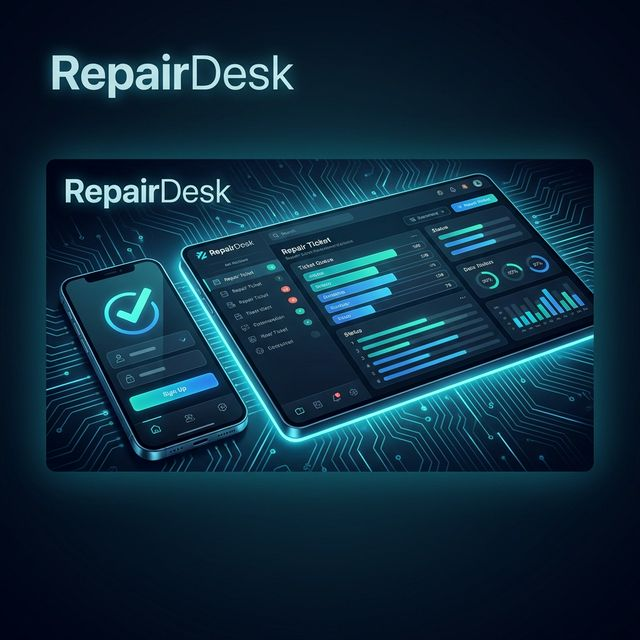

<div align="center">



# 🎫 RepairDesk

**The ultimate digital workflow for modern repair shops.**  
Built for speed, engineered for profit, and designed for clarity.

[](https://vercel.com)
[](https://nextjs.org)
[](https://fastapi.tiangolo.com)
[](LICENSE)

</div>

---

## 📖 Overview

**RepairDesk** is a mobile-first Progressive Web App (PWA) that empowers independent repair shops to manage their entire lifecycle—from the moment a device is dropped off to the final invoice. It eliminates paperwork and provides real-time insights into net profits and inventory health.

### ✨ Key Features

*   ⚡ **Lightning Tickets** — Create and track repair tickets in under 60 seconds.
*   📦 **Smart Inventory** — Real-time tracking with low-stock alerts and auto-deduction.
*   💰 **Profit Engine** — Automatic calculation of revenue, part costs, and net margin per ticket.
*   🧾 **Pro Invoicing** — Generate sleek PDF invoices via WeasyPrint and share instantly.
*   📊 **Financial Hub** — Dynamic reports showing daily, weekly, and monthly performance.
*   📱 **PWA Ready** — Installable on iOS/Android with offline synchronization.

---

## 🛠️ Tech Stack

| Layer | Technologies |
|---|---|
| **Frontend** | [Next.js 14](https://nextjs.org) (App Router), TailwindCSS, Zustand, Zod |
| **Backend** | [FastAPI](https://fastapi.tiangolo.com) (Python 3.12), SQLAlchemy 2 (Async), Pydantic v2 |
| **Database** | [PostgreSQL 16](https://www.postgresql.org/) |
| **Caching** | [Redis 7](https://redis.io/) |
| **Storage** | [MinIO](https://min.io/) (S3 Compatible) |
| **Infrastructure** | Docker, Nginx, Vercel |

---

## 🚀 Getting Started

### 📋 Prerequisites

*   **Docker Desktop** (Recommended)
*   **Make** (for Windows, use WSL or run commands from the Makefile)
*   **Node.js 20+** (Optional, for local web development)

### 🛠️ Local Development (Docker)

The fastest way to get up and running is using our unified Docker stack.

```bash
# 1. Clone the repository
git clone https://github.com/mohd98zaid/RepairDesk.git
cd RepairDesk

# 2. Setup Environment
cp .env.example .env

# 3. Boot Services
make dev

# 4. Initialize Database
make migrate
make seed
```

Local URLs:
- **Frontend**: `http://localhost:3000`
- **Backend API**: `http://localhost:8000/api/v1`
- **Interactive Docs**: `http://localhost:8000/docs`

---

## 📂 Project Structure

```text
RepairDesk/
├── apps/
│   ├── api/          # FastAPI Backend (Python)
│   └── web/          # Next.js Frontend (TSX)
├── docs/             # Reorganized requirements & architecture
├── infra/            # Docker, Nginx & Compose configs
├── api/              # Vercel Serverless Entry points
├── Makefile          # Unified development commands
├── init-and-run.bat  # ONE-CLICK Windows setup and startup
└── vercel.json       # Monorepo deployment config
```

---

## ☁️ Deployment

### Vercel (Recommended)
This project is pre-configured for Vercel Monorepos.

1.  Connect your GitHub repository to Vercel.
2.  The `vercel.json` at the root will automatically handle routing:
    -   Frontend: Serves from `apps/web`.
    -   API: Routes `/api/*` to the FastAPI backend via `api/index.py`.
3.  Ensure your environment variables (from `.env`) are added to the Vercel Project Settings.

---

## 🗺️ Roadmap & Phases

| Phase | Status | Focus |
|---|---|---|
| **Phase 1** | ✅ | Foundation, Auth, and Dockerization |
| **Phase 2** | ✅ | Customer & Ticket Management |
| **Phase 3** | ✅ | Inventory & Profit Tracking System |
| **Phase 4** | ✅ | Reports, PDF Invoicing & PWA Sync |
| **Phase 5** | 🚀 | QA, Hardening & Cloud Deployment |

---

## 🛡️ Security

-   **JWT Authentication**: Secure stateless auth with refresh token rotation.
-   **RBAC**: Role-based access control for owners and staff.
-   **Environment Safety**: `.env` files are tracked but sensitive production secrets should be managed via Vercel/Docker secrets.

---

<div align="center">
Built with ❤️ for Repair Shops everywhere.
</div>
